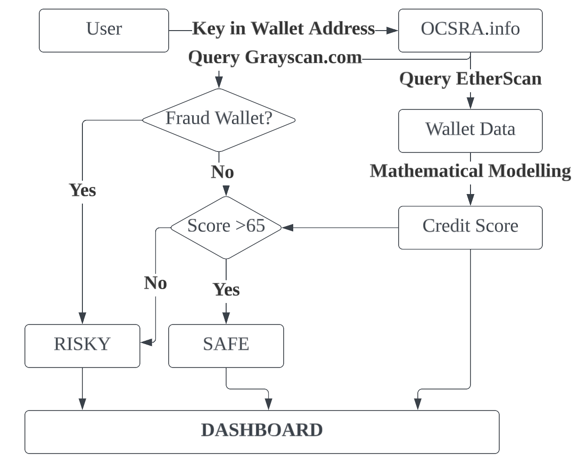

# OCSRA.info

> On-chain Credit Scoring and Risk Analysis

OCSRA is short for on-chain credit score and risk analysis. It is an open-source protocol which helps developers to offer better DeFi products, specifically those requiring background knowledge of the wallet, including the underlying risks (e.g fraud address, mule address, etc). The main customer of this product should be DeFi loan platform, which would help to provide users with customised lending terms for borrowers, without scaring them away with underlying terms or collaterals. 

This repo contains only the **front-end** of the product. The API `https://api.ocsra.info/` is a simple HTTP server coded with Python.

## Project Structure

```
.
├── components          # The components used in front-end
│   ├── Card            # Card components (Shown in the wallet info screen (top-left corner))
│   ├── Chart           # Chart components used to show the line graph in wallet activity card
│   ├── global          # The common used element (Header, Footer, and Input bar for address)
│   ├── DataCards.jsx   # A combined components for cardsshown in wallet information
│   ├── DataTable.jsx   # Table component to show past transactions.
│   ├── Logo.jsx        # Logo component
│   ├── UserAddress.jsx # The right hand side wallet stat address bar
│   ├── UserStats.jsx   # The right hand side user stat component's bottom three info item
│   ├── WalletData.jsx  # The combined components used to show in the address information page
│   ├── WalletUser.jsx  # The right hand side user stat component
├── layouts             # App layout definition
├── pages               # Pages definition 
├── public              # Public assets 
├── styles              # CSS files
├── utilities           # Lottie assets
├── package.json
├── next.config.js
├── LICENSE
└── README.md
```

## Simple flowchart



## How to use this code?

1. Clone the repository:
```bash
git clone https://github.com/hongvin/OCSRA.info
```

2. Install dependencies:

```bash
npm install
```

3. Run development server

```bash
npm run dev
```

4. Build the front-end

```bash
npm run build
npm run start
```


## Acknowledgements

1. [React ChartJS](https://github.com/reactchartjs/react-chartjs-2) and [chart.js](https://github.com/chartjs/Chart.js) for nice chart inside card.
2. [Wagmi](https://github.com/wagmi-dev/wagmi) hooks for Ethereum
3. [RainbowKit](https://github.com/rainbow-me/rainbowkit) for wallet connection
4. [Lottie](https://lottiereact.com) for lightweight animation
5. Internet downloaded PNGs
6. Stack Overflow for debugging
